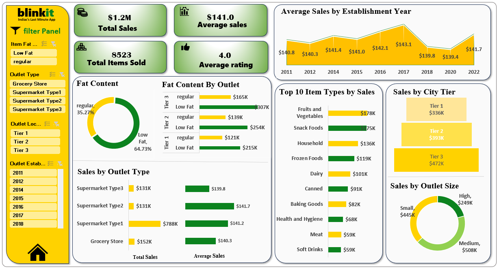

# Blinkit Sales Analysis Dashboard (Excel Project)
This project presents a **Blinkit Sales Analysis Dashboard** built using **Microsoft Excel**. The dashboard provides insights into sales performance, item categories, outlet types, and outlet locations.

## Tools Used

- Microsoft Excel
- Pivot Tables
- Data Cleaning
- Data Visualization
- Interactive Dashboard

## Dashboard Insights
The dashboard analyzes:
- Total Sales: **$1.2M**
- Total Items Sold: **8523**
- Average Sales: **$141**
- Average Rating: **4.0**

Key analysis includes:
- Sales by Outlet Type
- Sales by City Tier
- Sales by Outlet Size
- Top 10 Item Types by Sales
- Fat Content Distribution
- Average Sales by Establishment Year

## Purpose of the Project
The goal of this project is to practice **data analysis and dashboard creation using Excel** and extract meaningful business insights from sales data.

## Dashboard Preview

## Author
Prajakta Kumbhar

